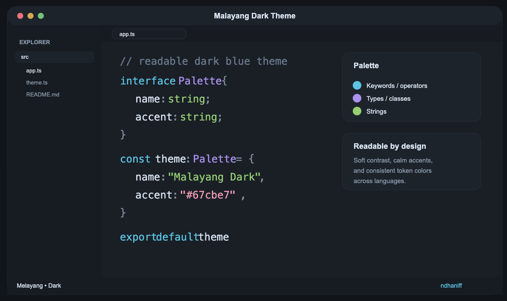
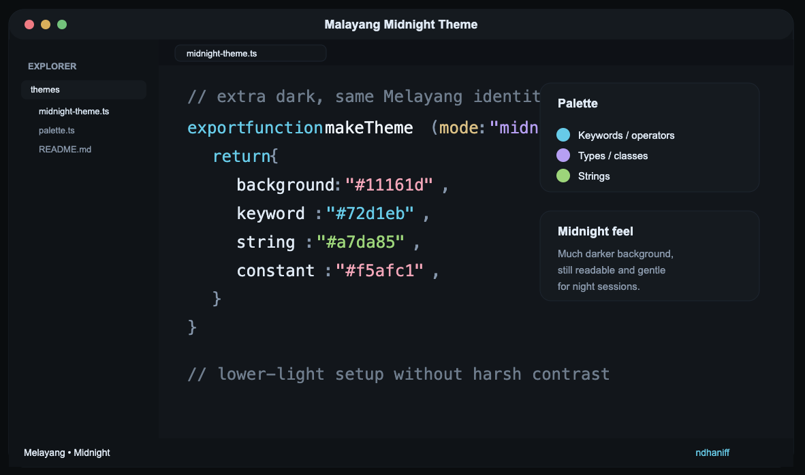
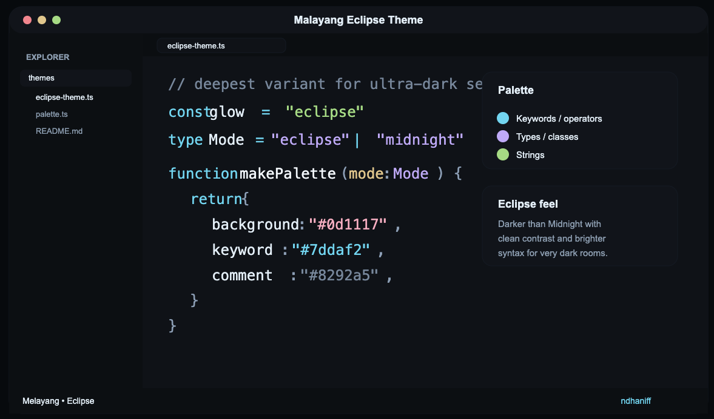
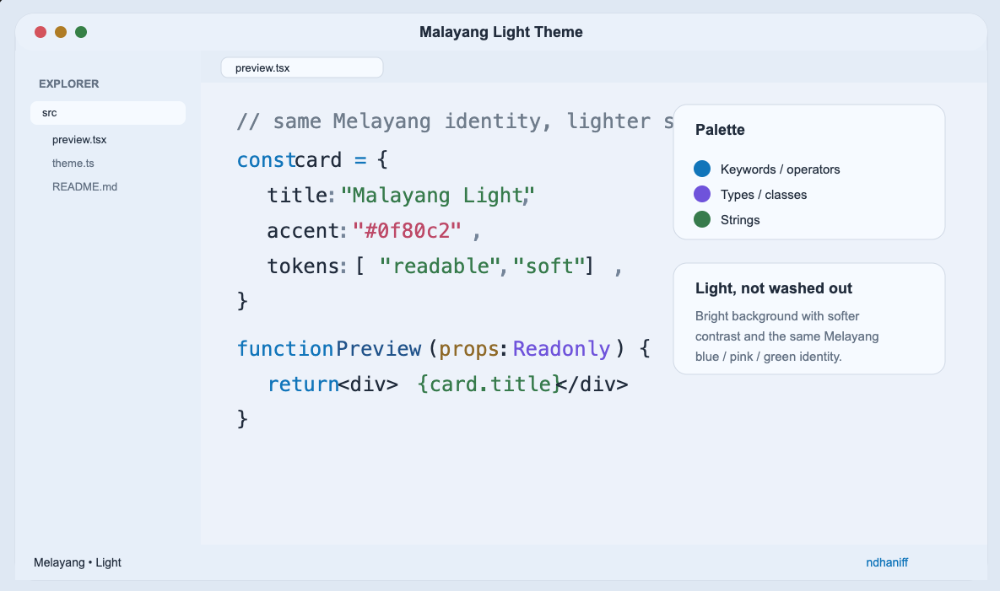

# Melayang VS Code Theme

Readable VS Code themes built around Melayang's identity:

- cool blue keywords and accents
- soft pink constants
- calm green strings
- balanced contrast for long coding sessions

## Variants

- **Malayang Dark Theme** — refined dark default
- **Malayang Midnight Theme** — much darker for low-light setups
- **Malayang Eclipse Theme** — the deepest dark variant, darker than Midnight
- **Malayang Light Theme** — matching light variant with the same color identity

## What's improved

- better readability and softer contrast
- more complete workbench/UI coverage
- richer semantic highlighting
- more consistent token mapping across languages
- matching dark, midnight, eclipse, and light variants

## Color language

Melayang now uses a more consistent token system across supported languages:

- **Keywords / operators** → blue
- **Types / classes / interfaces** → lavender
- **Strings** → green
- **Constants / numbers / booleans** → pink
- **Parameters** → warm sand
- **Comments** → muted blue-gray

## Previews

### Malayang Dark Theme

### Malayang Midnight Theme

### Malayang Eclipse Theme

### Malayang Light Theme

## Usage

1. Install the extension.
2. Open **Preferences: Color Theme**.
3. Choose **Malayang Dark Theme**, **Malayang Midnight Theme**, **Malayang Eclipse Theme**, or **Malayang Light Theme**.

**Enjoy!**
